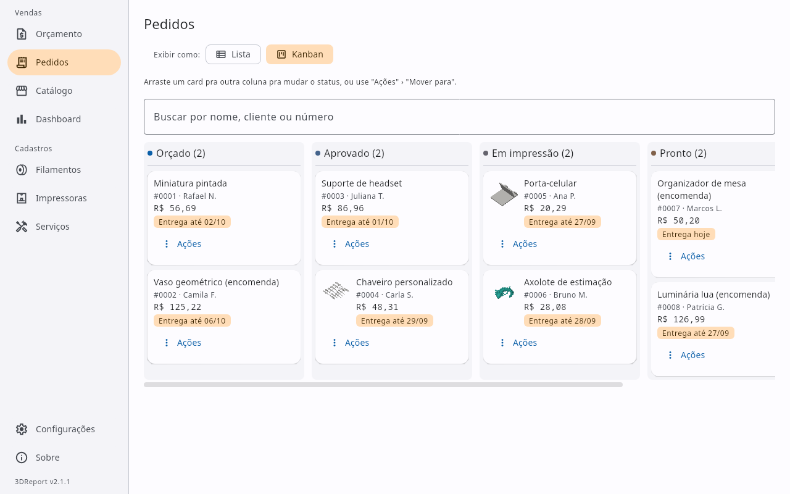
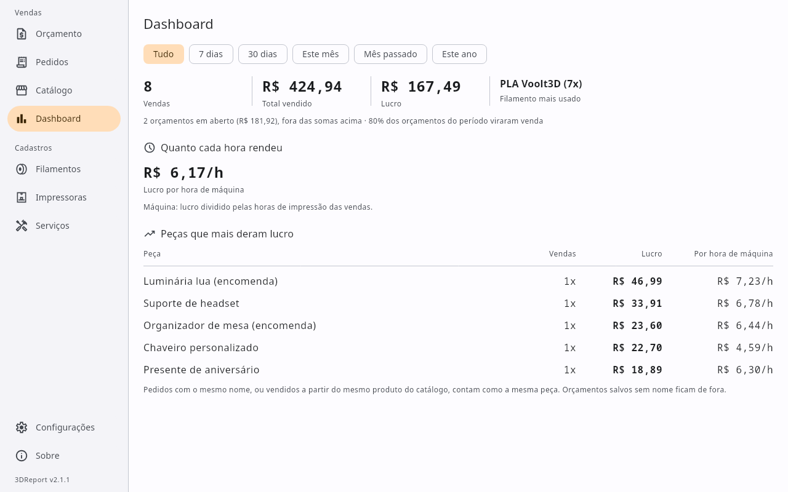
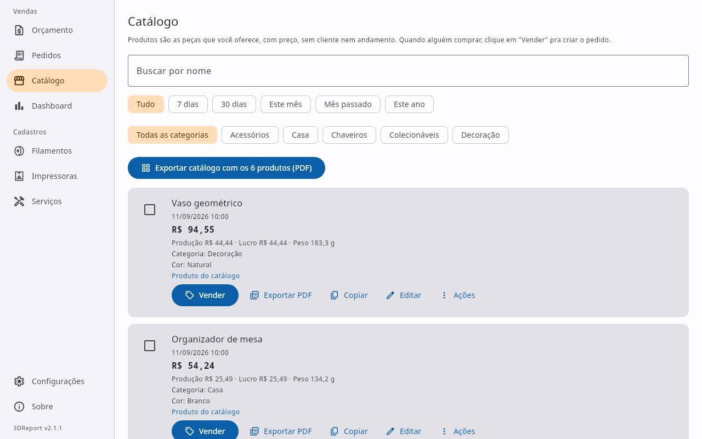
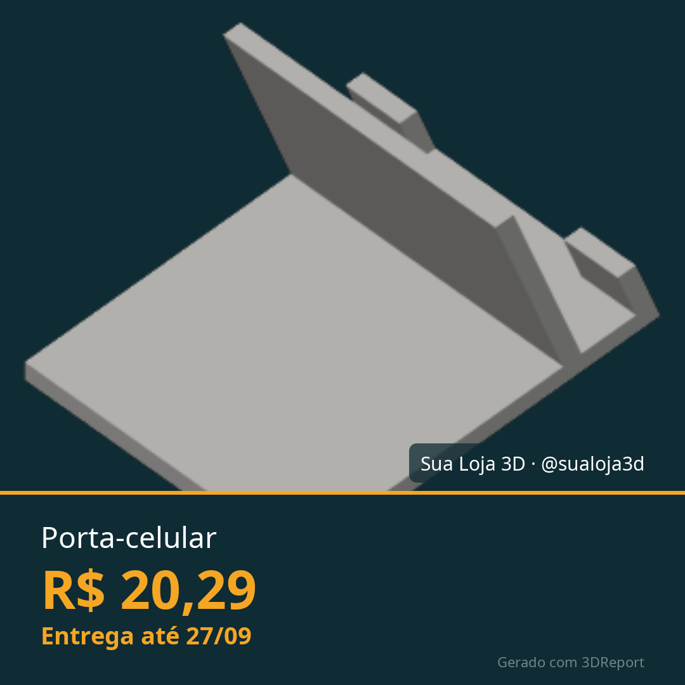

<p align="center">
  
</p>

<h1 align="center">3DReport</h1>

<p align="center">
  <a href="https://github.com/mateustoin/3DReport/releases/latest"></a>
  <a href="LICENSE"></a>
  
  
  <a href="https://github.com/mateustoin/3DReport/actions/workflows/ci.yml"></a>
  <a href="https://github.com/mateustoin/3DReport/actions/workflows/release.yml"></a>
  <a href="https://buymeacoffee.com/mateustoin"></a>
</p>

<p align="center">
  <a href="https://mateustoin.github.io/3DReport/">Site</a> ·
  <a href="https://github.com/mateustoin/3DReport/releases/latest">Download</a> ·
  <a href="https://mateustoin.github.io/3DReport/calculadora.html">Calculadora online</a> ·
  <a href="https://mateustoin.github.io/3DReport/manual.html">Manual rápido</a>
</p>

**O sistema de quem vende impressão 3D**, gratuito, de código aberto e 100% no
seu computador. Arraste o G-code e o **orçamento de impressão 3D** se monta com
o custo real (filamento, energia, máquina, o seu tempo, imposto e a taxa de
cada canal de venda); mande pro cliente no WhatsApp ou em PDF com a sua marca;
negocie sem perder dinheiro; e acompanhe cada pedido até a entrega. Sem conta e
sem mensalidade: seus preços e seus clientes não saem da sua máquina.

## Sumário

- [Funcionalidades](#funcionalidades)
- [Screenshots](#screenshots)
- [Apoie o projeto](#apoie-o-projeto)
- [Stack](#stack)
- [Início rápido](#início-rápido)
- [Instaladores](#instaladores)
- [Estrutura](#estrutura)
- [Documentação](#documentação)
- [Contribuindo](#contribuindo)
- [Licença](#licença)

## Funcionalidades

<details>
<summary>Ver lista completa (30+ prontas)</summary>

**Orçamento**
- Cálculo de custo de produção e preço de venda (`core`)
- Arraste o G-code pra janela e o orçamento se monta: comprimento, tempo, foto, configurações de impressão e, quando o nome bate com o cadastrado, a impressora e o filamento (Bambu Studio, OrcaSlicer, PrusaSlicer, SuperSlicer, Cura)
- Peça multicolor (AMS, MMU): vários filamentos na mesma impressão, cada um com os seus metros e o seu preço; o G-code multicolor já preenche o consumo de cada extrusor, com purga e torre
- Pedido com várias impressões (peça grande, diorama, várias mesas numa entrega só): cada impressão é um cartão com a própria impressora, filamentos, tempo e G-code, mas o cliente vê um item, um preço e um prazo só
- Editar um pedido ou produto salvo acontece na própria aba de Orçamento (duas colunas), sem diálogo, com uma barra "Editando #0042" e "Cancelar edição"
- Tela de orçamento em duas colunas — entradas de um lado, o preço, a composição e a negociação do outro
- Quantidade por orçamento, com preço unitário e o seu tempo de trabalho informado pelo pedido inteiro (lote sai mais barato por peça)
- Negociação: digite o preço fechado com o cliente e veja lucro, margem e aviso de prejuízo, com o preço mínimo sempre à vista, e veja no Dashboard quanto de desconto você deu no período
- Comparação entre as suas impressoras: quanto a mesma peça custa em cada máquina
- Salvar orçamento (nome, foto e link do modelo opcionais)
- Serviços opcionais no orçamento (pintura, lixamento, entrega etc.), com o valor digitado em cada pedido e cobrança por peça ou uma vez pelo pedido
- Canais de venda com taxa própria (Shopee, Mercado Livre, cartão, Pix), escolhidos por orçamento
- Imposto sobre a venda e frete como linha própria, sem embutir no preço da peça
- Link do modelo clicável (abre no navegador) e peso da peça (uso interno)

**Pedidos, Catálogo & Dashboard**
- Pedidos (histórico de orçamentos) em tela própria: consultar, filtrar, baixar foto, excluir; pedidos com mais de uma impressão mostram "N impressões"
- Cliente e status do pedido por orçamento
- Catálogo em tela própria, separado dos pedidos: guarde peças com preço sem cliente (pra quem está começando ou monta vitrine), fora do Kanban e do Dashboard, e crie o pedido com um clique em "Vender"
- Dashboard que mostra o catálogo e qual peça vale a pena oferecer primeiro enquanto ainda não há vendas
- Catálogo vivo: aviso quando os custos mudaram e o preço do produto precisa ser atualizado, preço anunciado redondo (R$ 18,90) no lugar do calculado e categorias que separam o catálogo em PDF em seções
- Exportar em PDF ou copiar/colar (nome + valor de venda + foto no PDF)
- Abrir a conversa no WhatsApp com o orçamento já escrito, e gerar uma imagem quadrada da peça pro zap ou pro status
- Prazo de entrega no orçamento, em destaque no PDF, na mensagem e na imagem, com aviso em Pedidos quando o prazo vence
- Exportar vários orçamentos selecionados num PDF só (um por página)
- Catálogo/portfólio exportável em PDF (grade, várias peças por página)
- Dashboard: o que foi vendido no período (orçamento só conta quando o cliente aprova), quanto cada hora de máquina e de trabalho rendeu, as peças que mais dão lucro e os clientes que mais pedem desconto

**Catálogos**
- Cadastro de filamentos — marca, tipo de material (com densidade sugerida), várias cores e controle manual de estoque por cor
- Cadastro de impressoras — perfis salvos (consumo, manutenção, investimento), com catálogo pré-cadastrado das principais marcas pra escolher
- Manutenção por impressora: cada componente com o seu intervalo em horas (trocar bico, lubrificar eixos), aviso quando está perto ou vencido, diário do que foi feito e horas de uso fora de orçamento (calibração, reimpressão)
- Arquivar filamento, impressora, serviço ou canal de venda em uso: some das escolhas de um orçamento novo sem apagar nada, e pedidos/produtos antigos continuam calculando normalmente

**Personalização do PDF**
- Sua marca no PDF: logo e contato (WhatsApp, e-mail, Instagram) no cabeçalho, borda opcional, marca d'água e rodapé com o nome
- Assinatura discreta "Gerado com 3DReport" no canto do PDF (com link pro site) e da imagem do WhatsApp
- Prévia do PDF em Configurações ("Ver como fica"), antes mesmo de salvar
- Templates — fotos salvas da aparência do PDF (marca d'água, rodapé, borda, tempo de impressão), com indicador do template ativo; logo e contato ficam de fora, pra não se perderem ao trocar de template

**Configurações & plataforma**
- Barra lateral com as telas agrupadas (Vendas, Cadastros, Configurações e Sobre); abaixo de uma certa largura de janela vira um trilho só de ícones com dica ao passar o mouse
- Configurações em seções (Negócio e custos, Canais, Documentos pro cliente, Aparência, Dados), com uma barra "Alterações não salvas" só, no lugar de vários botões "Salvar" espalhados
- Backup e restauração dos seus dados num arquivo `.zip` (levar pro outro computador, recuperar depois de formatar)
- Múltiplas moedas (BRL, USD, EUR, GBP), com separador decimal/milhar correto
- Tema claro/escuro (segue o sistema por padrão)
- Atalhos de teclado: `Ctrl`/`Cmd` + `1` a `8` pulam direto pra cada tela da barra lateral (Orçamento, Pedidos, Catálogo, Dashboard, Filamentos, Impressoras, Serviços, Configurações), fora salvar/limpar orçamento
- Confirmação antes de excluir (filamentos, impressoras, serviços, pedidos)
- A janela lembra tamanho, posição e se estava maximizada, e volta a abrir assim (se ainda couber na tela)
- Verificação opcional de nova versão: desligada por padrão; quando ligada, ao abrir o app a única coisa que sai da sua máquina é uma consulta à página pública de releases do GitHub, pra avisar se há uma versão mais nova
- Persistência em disco (`~/.3dreport/`, arquivos JSON + fotos). A 2.0 mudou o formato dos dados: ao abrir, os dados da 1.x são guardados em `~/.3dreport-v1`, sem conversão e sem apagar nada
- Versão do app e a tela Sobre (autor, GitHub, doação e um resumo de cada tela)

</details>

## Screenshots

<p align="center">
  
  
  
  
  
  
</p>

Os prints saem do próprio app, com dados de exemplo (ver [development.md](docs/development.md#prints-do-site)).
Textos prontos, fatos e imagens pra quem quiser escrever sobre o projeto estão na
[página de imprensa](https://mateustoin.github.io/3DReport/imprensa.html).

## Apoie o projeto

O 3DReport é e sempre será gratuito e de código aberto — não há edição paga
nem assinatura. Se ele te ajuda, considere uma doação voluntária:
[Buy Me a Coffee](https://buymeacoffee.com/mateustoin).

## Stack

- Kotlin 2.4.20 · Kotlin Multiplatform
- Compose Multiplatform 1.12.0 · Material 3
- Gradle 9.7.1 (wrapper) · JDK 21
- Plataforma: desktop (Windows/Linux/macOS). Android planejado.

## Início rápido

```bash
./gradlew :composeApp:run   # executa o app desktop
./gradlew allTests          # roda os testes
./gradlew build             # compila e testa tudo
```

Pré-requisito: JDK 21. IDE recomendada: Android Studio ou IntelliJ IDEA (VS Code
funciona via terminal). Detalhes em [docs/development.md](docs/development.md).

## Instaladores

Instaladores nativos (`.deb`/`.msi`/`.dmg`) são gerados por CI a cada release
e publicados em [GitHub Releases](https://github.com/mateustoin/3DReport/releases).
Como não são assinados digitalmente (custo recorrente incompatível com o
modelo 100% gratuito/doação), o Windows pode avisar "Editor desconhecido"
(clique em "Mais informações → Executar assim mesmo") e o macOS pode
bloquear a abertura na primeira vez — tente clique direito → "Abrir"; se
isso não resolver (comum em versões mais recentes do macOS), vá em
Ajustes do Sistema → Privacidade e Segurança e clique em "Abrir mesmo
assim" no aviso sobre o app bloqueado.

## Estrutura

```
core/        Domínio e motor de cálculo (Kotlin Multiplatform puro, sem UI)
composeApp/  Interface Compose Multiplatform (desktop)
web/         Calculadora do site: o core compilado pra JavaScript
docs/        Documentação
site/        Site institucional (GitHub Pages)
```

## Documentação

| Documento | Conteúdo |
|---|---|
| [CHANGELOG.md](CHANGELOG.md) | O que mudou em cada versão |
| [docs/development.md](docs/development.md) | Setup, IDE, executar, testar, empacotar |
| [docs/architecture.md](docs/architecture.md) | Módulos, plataformas, convenções |
| [docs/pricing-formulas.md](docs/pricing-formulas.md) | Parâmetros e fórmulas de cálculo |
| [docs/decisions.md](docs/decisions.md) | Decisões aprovadas e pendentes |
| [docs/roadmap.md](docs/roadmap.md) | Backlog de evoluções e próximas implementações |
| [core/README.md](core/README.md) | Módulo `core` |
| [composeApp/README.md](composeApp/README.md) | Módulo `composeApp` |
| [CONTRIBUTING.md](CONTRIBUTING.md) | Como propor mudanças e enviar um PR |

## Contribuindo

Contribuições são bem-vindas. Veja [CONTRIBUTING.md](CONTRIBUTING.md) para o
fluxo de setup, testes e envio de PR.

## Licença

Código aberto sob [Apache License 2.0](LICENSE). Gratuito, sem edição paga —
veja [Apoie o projeto](#apoie-o-projeto).

Os ícones da interface vêm do Material Symbols (Google, Apache 2.0); detalhes em
[THIRD-PARTY-NOTICES.md](THIRD-PARTY-NOTICES.md).
