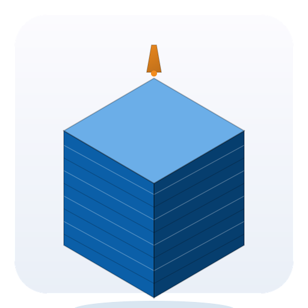
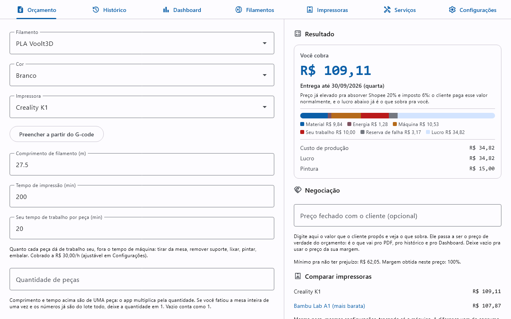
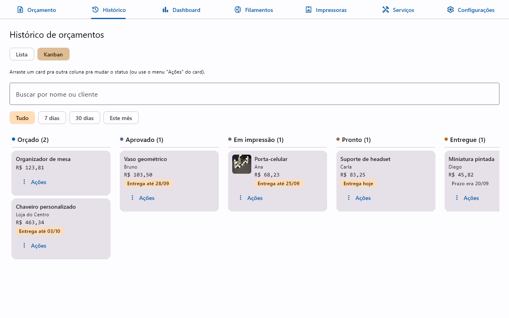
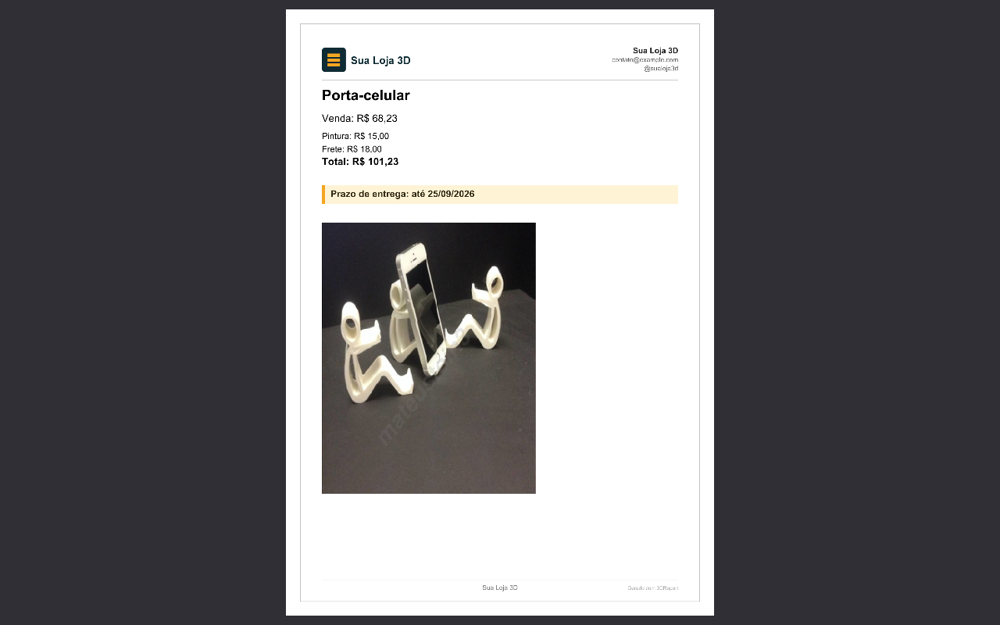

<p align="center">
  
</p>

<h1 align="center">3DReport</h1>

<p align="center">
  <a href="CHANGELOG.md"></a>
  <a href="LICENSE"></a>
  
  
  <a href="https://github.com/mateustoin/3DReport/actions/workflows/ci.yml"></a>
  <a href="https://github.com/mateustoin/3DReport/actions/workflows/release.yml"></a>
  <a href="https://buymeacoffee.com/mateustoin"></a>
</p>

<p align="center">
  <a href="https://mateustoin.github.io/3DReport/">Site</a> ·
  <a href="https://github.com/mateustoin/3DReport/releases/latest">Download</a> ·
  <a href="https://mateustoin.github.io/3DReport/manual.html">Manual rápido</a>
</p>

Aplicativo **gratuito e de código aberto** para criação de **orçamentos de
impressão 3D**. A partir do filamento usado, da impressora escolhida (cada uma
com seu próprio perfil salvo) e dos dados da peça (comprimento em metros e
tempo de impressão), calcula o **valor de produção** e o **valor de venda**
com a margem de lucro desejada.

> **Status:** motor de cálculo implementado e testado; telas de orçamento
> (com salvar e exportar), histórico de orçamentos, cadastro de filamentos,
> cadastro de impressoras e configurações gerais funcionando, com
> persistência real em disco. Veja o backlog em [docs/roadmap.md](docs/roadmap.md).

## Sumário

- [Funcionalidades](#funcionalidades)
- [Screenshots](#screenshots)
- [Apoie o projeto](#apoie-o-projeto)
- [Stack](#stack)
- [Início rápido](#início-rápido)
- [Instaladores](#instaladores)
- [Estrutura](#estrutura)
- [Documentação](#documentação)
- [Contribuindo](#contribuindo)
- [Licença](#licença)

## Funcionalidades

<details>
<summary>Ver lista completa (20+ prontas)</summary>

**Orçamento**
- Cálculo de custo de produção e preço de venda (`core`)
- Tela de orçamento — escolhe filamento + impressora, informa comprimento/tempo → produção/venda
- Quantidade por orçamento, com preço unitário e preparo do pedido cobrado uma vez só (lote sai mais barato por peça)
- Salvar orçamento (nome, foto e link do modelo opcionais)
- Serviços opcionais no orçamento (pintura, lixamento, embalagem/spray etc.)
- Canais de venda com taxa própria (Shopee, Mercado Livre, cartão, Pix), escolhidos por orçamento
- Imposto sobre a venda e frete como linha própria, sem embutir no preço da peça
- Link do modelo clicável (abre no navegador) e peso da peça (uso interno)

**Histórico & Dashboard**
- Histórico de orçamentos — consultar, filtrar, baixar foto, excluir
- Cliente e status do pedido por orçamento
- Exportar em PDF ou copiar/colar (nome + valor de venda + foto no PDF)
- Exportar vários orçamentos selecionados num PDF só (um por página)
- Catálogo/portfólio exportável em PDF (grade, várias peças por página)
- Dashboard — total vendido, lucro e filamento mais usado, por período

**Catálogos**
- Cadastro de filamentos — marca, tipo de material (com densidade sugerida), várias cores e controle manual de estoque por cor
- Cadastro de impressoras — perfis salvos (consumo, manutenção, investimento), com catálogo pré-cadastrado das principais marcas pra escolher

**Personalização do PDF**
- Marca d'água personalizada (texto, configurável em Configurações)
- Templates — fotos salvas de marca d'água/rodapé, com indicador do template ativo

**Configurações & plataforma**
- Configurações gerais do negócio (energia, valor da sua hora de trabalho, custo fixo mensal, falhas, margem)
- Backup e restauração dos seus dados num arquivo `.zip` (levar pro outro computador, recuperar depois de formatar)
- Múltiplas moedas (BRL, USD, EUR, GBP), com separador decimal/milhar correto
- Tema claro/escuro (segue o sistema por padrão)
- Atalhos de teclado (navegação entre abas, salvar/limpar orçamento)
- Confirmação antes de excluir (filamentos, impressoras, serviços, histórico)
- Persistência em disco (`~/.3dreport/`, arquivos JSON + fotos)
- Versão do app + rodapé com autor/GitHub/doação + ajuda

</details>

## Screenshots

<p align="center">
  
  
  
</p>

## Apoie o projeto

O 3DReport é e sempre será gratuito e de código aberto — não há edição paga
nem assinatura. Se ele te ajuda, considere uma doação voluntária:
[Buy Me a Coffee](https://buymeacoffee.com/mateustoin).

## Stack

- Kotlin 2.4.20 · Kotlin Multiplatform
- Compose Multiplatform 1.12.0 · Material 3
- Gradle 9.7.1 (wrapper) · JDK 21
- Plataforma: desktop (Windows/Linux/macOS). Android planejado.

## Início rápido

```bash
./gradlew :composeApp:run   # executa o app desktop
./gradlew allTests          # roda os testes
./gradlew build             # compila e testa tudo
```

Pré-requisito: JDK 21. IDE recomendada: Android Studio ou IntelliJ IDEA (VS Code
funciona via terminal). Detalhes em [docs/development.md](docs/development.md).

## Instaladores

Instaladores nativos (`.deb`/`.msi`/`.dmg`) são gerados por CI a cada release
e publicados em [GitHub Releases](https://github.com/mateustoin/3DReport/releases).
Como não são assinados digitalmente (custo recorrente incompatível com o
modelo 100% gratuito/doação), o Windows pode avisar "Editor desconhecido"
(clique em "Mais informações → Executar assim mesmo") e o macOS pode
bloquear a abertura na primeira vez — tente clique direito → "Abrir"; se
isso não resolver (comum em versões mais recentes do macOS), vá em
Ajustes do Sistema → Privacidade e Segurança e clique em "Abrir mesmo
assim" no aviso sobre o app bloqueado.

## Estrutura

```
core/        Domínio e motor de cálculo (Kotlin Multiplatform puro, sem UI)
composeApp/  Interface Compose Multiplatform (desktop)
docs/        Documentação
site/        Site institucional (GitHub Pages)
```

## Documentação

| Documento | Conteúdo |
|---|---|
| [CHANGELOG.md](CHANGELOG.md) | O que mudou em cada versão |
| [docs/development.md](docs/development.md) | Setup, IDE, executar, testar, empacotar |
| [docs/architecture.md](docs/architecture.md) | Módulos, plataformas, convenções |
| [docs/pricing-formulas.md](docs/pricing-formulas.md) | Parâmetros e fórmulas de cálculo |
| [docs/decisions.md](docs/decisions.md) | Decisões aprovadas e pendentes |
| [docs/roadmap.md](docs/roadmap.md) | Backlog de evoluções e próximas implementações |
| [core/README.md](core/README.md) | Módulo `core` |
| [composeApp/README.md](composeApp/README.md) | Módulo `composeApp` |
| [CONTRIBUTING.md](CONTRIBUTING.md) | Como propor mudanças e enviar um PR |

## Contribuindo

Contribuições são bem-vindas. Veja [CONTRIBUTING.md](CONTRIBUTING.md) para o
fluxo de setup, testes e envio de PR.

## Licença

Código aberto sob [Apache License 2.0](LICENSE). Gratuito, sem edição paga —
veja [Apoie o projeto](#apoie-o-projeto).
